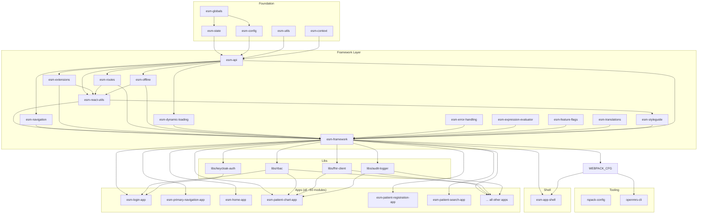

# SIH Salus Frontend Monorepo Migration Plan

**Version:** 1.2
**Date original:** 2026-03-14 | **Última actualización:** 2026-03-30
**Repository:** `sihsalus/frontend-web`
**Author:** Architecture Team — PUCP-GIDIS-HIISC

---

## Current Status (2026-03-30)

| Phase | Estado |
|-------|--------|
| 0 — Scaffolding | ✅ DONE |
| 1 — Import openmrs-esm-core | ❌ CANCELLED — framework/shell consumidos como npm deps |
| 2 — Migrate Upstream Modules | ✅ DONE |
| 3 — Migrate Custom Modules | ✅ DONE |
| 4 — RBAC | 🔶 IN PROGRESS — estructura de libs creada, falta wire-up |
| 5 — Styling | ⏳ PENDING |
| 6 — FHIR | 🔶 IN PROGRESS — `@sihsalus/fhir-client` creado, falta implementación |
| 7 — Extension Reduction | ⏳ PENDING |
| 8 — Testing & QA | ⏳ PENDING — 80% threshold activo, cobertura real pendiente |
| 9 — Build/Docker/Deploy | ✅ DONE — init container con `pacote`, distinto al plan original |
| 10 — Docs & Handoff | ⏳ PENDING |

**Decisiones arquitectónicas que divergieron del plan original:**
- Phase 1 cancelada: framework (`@openmrs/esm-framework`) y shell (`@openmrs/esm-app-shell`) se consumen como npm deps, no se vendorizan.
- `packages/shell/` existe pero NO está en workspaces — es solo referencia local al npm dep.
- Phase 9 reimplementada: en lugar de un script simple de copia, se usa un **init container** que corre `assemble-importmap.js` en deployment time. El script descarga módulos `@openmrs/*` desde **npm registry** usando `pacote` (no desde el backend en vivo). Configuración via `config/spa-assemble-config.json`.
- Override resolution: módulos locales `@openmrs/*` (ej. `esm-patient-registration-app`) ahora se incluyen correctamente en el importmap — el filtro original `@sihsalus/*`-only fue un bug corregido.
- Stack: Node 22, Turborepo `100%` concurrency, `@swc/core` 1.15.21, sass 1.98.0, swr 2.4.1.

---

## Executive Summary

This document defines the phased migration of the SIH Salus frontend from a distributed multi-repo architecture (OpenMRS upstream + custom `sihsalus-esm-modules`) into a **single Turborepo-powered monorepo** at `sihsalus/frontend-web`. The monorepo consolidates ~50 frontend modules and introduces HIPAA-compliant RBAC, FHIR-first data access, and Keycloak OIDC support. The OpenMRS framework (`@openmrs/esm-framework`) and app shell are consumed as external npm dependencies — not vendorized into the monorepo.

---

## Phase Summary Table

| Phase | Description | Size | Depends On | Key Risk | Status |
|-------|-------------|------|------------|----------|--------|
| 0 | Repository Scaffolding & Turborepo Setup | M | — | Tooling compatibility | ✅ DONE |
| 1 | Import `openmrs-esm-core` as Foundation | L | 0 | Build pipeline adaptation | ❌ CANCELLED |
| 2 | Migrate OpenMRS Upstream Modules | XL | 1 | Import path breakage, test failures | ✅ DONE |
| 3 | Migrate Custom SIH Salus Modules | M | 1 | Scope rename, override resolution | ✅ DONE |
| 4 | HIPAA-Compliant RBAC Implementation | L | 1,3 | Privilege model mapping | 🔶 IN PROGRESS |
| 5 | Styling Consolidation | M | 2,3 | Carbon/Tailwind conflicts | ⏳ PENDING |
| 6 | FHIR-First Data Access Refactor | L | 2,3 | Missing FHIR endpoints | 🔶 IN PROGRESS |
| 7 | Extension System Reduction | M | 2,3 | Broken slots/navigation | ⏳ PENDING |
| 8 | Testing & Quality Assurance | L | 2,3,4,5,6,7 | Coverage gaps | ⏳ PENDING |
| 9 | Build, Docker & Deployment Integration | L | 8 | Image size, Nginx routing | ✅ DONE |
| 10 | Documentation & Handoff | S | 9 | — | ⏳ PENDING |

> **Parallelism:** Phases 2 & 3 can run in parallel. Phases 4, 5, 6, 7 can run in parallel after 2 & 3 complete. Phase 8 is the convergence gate.
>
> **Note (2026-03-30):** Phase 1 was cancelled — framework/shell are npm deps. Phases 0, 2, 3, 9 complete. Phase 4 and 6 partially implemented (lib scaffolding done, implementation pending).

---

## Module Compatibility Matrix

| SIH Salus Override (`@sihsalus/*`) | Replaces Upstream (`@openmrs/*`) | Resolution Strategy |
|---|---|---|
| `esm-patient-registration-app` | `@openmrs/esm-patient-registration-app` 10.0.0 | SIH Salus version loads; upstream kept as `_upstream/` reference |
| `esm-patient-search-app` | `@openmrs/esm-patient-search-app` 10.0.0 | SIH Salus version loads; upstream kept as `_upstream/` reference |
| `esm-billing-app` | `@openmrs/esm-billing-app` 1.1.1 | SIH Salus version loads; upstream removed |
| `esm-patient-immunizations-app` | `@openmrs/esm-patient-immunizations-app` 12.0.1 | SIH Salus version loads; upstream kept as `_upstream/` reference |
| `esm-coststructure-app` | — (new) | No conflict |
| `esm-dyaku-app` | — (new) | No conflict |
| `esm-fua-app` | — (new) | No conflict |
| `esm-indicators-app` | — (new) | No conflict |
| `esm-maternal-and-child-health-app` | — (new) | No conflict |
| `esm-consulta-externa-app` | — (new) | No conflict |
| `esm-sihsalus-widgets-app` | — (new) | No conflict |

**Import map resolution:** For overridden modules, the build pipeline generates import map entries under the `@openmrs/*` scope pointing to the SIH Salus bundle. This way, any upstream module that `import`s from `@openmrs/esm-patient-search-app` gets the SIH Salus version transparently. The `routes.json` in the SIH Salus override must declare the same page routes and extension slots as the upstream module it replaces.

---

## Dependency Graph (Build Order)



---

## Phase 0 — Repository Scaffolding & Turborepo Setup

### Objective

Initialize `sihsalus/frontend-web` with Turborepo, the chosen package manager, shared configurations, CI pipeline, and the complete directory structure — without any application code yet.

### Package Manager Decision: Yarn 4 (Berry)

**Choice:** Yarn 4 with PnP disabled (using `nodeLinker: node-modules`).

**Why not pnpm?** Despite pnpm's stricter dependency isolation, the entire OpenMRS ecosystem (`openmrs-esm-core`, all upstream modules, the `openmrs` CLI) is built and tested exclusively with Yarn 4. The CLI's `develop` command, the `rspack-config` package, and the service worker build all assume Yarn workspace resolution. Switching to pnpm would require patching the CLI, fixing phantom dependency issues across ~50 modules, and maintaining those patches against upstream. The migration risk is not justified.

**Why `nodeLinker: node-modules`?** PnP mode is incompatible with several OpenMRS tooling assumptions (direct `node_modules` paths in rspack/webpack configs, `require.resolve` calls in the CLI). Using `node-modules` mode gives us Yarn 4's workspace features and speed without PnP compatibility issues.

### Detailed Steps

#### Step 0.1 — Initialize the repository

```bash
cd /home/alvax/omrs/frontend-web
git checkout -b main

# Initialize package.json
cat > package.json << 'EOF'
{
  "name": "@sihsalus/frontend-web",
  "version": "1.0.0",
  "private": true,
  "workspaces": [
    "packages/shell/*",
    "packages/framework/*",
    "packages/tooling/*",
    "packages/apps/*",
    "packages/libs/*"
  ],
  "scripts": {
    "build": "turbo run build",
    "build:apps": "turbo run build --filter='./packages/apps/*'",
    "build:framework": "turbo run build --filter='./packages/framework/*'",
    "dev": "turbo run dev",
    "start": "openmrs develop",
    "test": "turbo run test",
    "test:e2e": "playwright test",
    "lint": "turbo run lint",
    "typecheck": "turbo run typescript",
    "verify": "turbo run lint typescript test",
    "clean": "turbo run clean",
    "setup": "yarn install && turbo run build",
    "postinstall": "husky install"
  },
  "devDependencies": {
    "@playwright/test": "^1.55.1",
    "@swc/core": "1.15.18",
    "@testing-library/dom": "^10.4.1",
    "@testing-library/jest-dom": "^6.8.0",
    "@testing-library/react": "^16.3.0",
    "@testing-library/user-event": "^14.6.1",
    "@types/react": "^18.3.21",
    "@types/react-dom": "^18.3.0",
    "@types/webpack-env": "^1.16.4",
    "@typescript-eslint/eslint-plugin": "^8.35.0",
    "@typescript-eslint/parser": "^8.35.0",
    "classnames": "^2.3.2",
    "cross-env": "^7.0.3",
    "dotenv": "^16.0.3",
    "eslint": "^8.55.0",
    "eslint-plugin-import": "^2.31.0",
    "eslint-plugin-jest-dom": "^5.5.0",
    "eslint-plugin-playwright": "^2.1.0",
    "eslint-plugin-react-hooks": "^4.6.2",
    "eslint-plugin-testing-library": "^7.1.1",
    "fake-indexeddb": "^4.0.2",
    "fork-ts-checker-webpack-plugin": "^7.2.13",
    "husky": "^8.0.3",
    "i18next-parser": "^9.3.0",
    "identity-obj-proxy": "^3.0.0",
    "lint-staged": "^15.2.9",
    "prettier": "^3.1.0",
    "swc-loader": "0.2.7",
    "timezone-mock": "^1.2.2",
    "turbo": "^2.5.2",
    "typescript": "^5.8.3"
  },
  "lint-staged": {
    "*.{ts,tsx}": "eslint --cache --fix --max-warnings 0",
    "*.{css,scss,ts,tsx}": "prettier --write --list-different"
  },
  "packageManager": "yarn@4.10.3",
  "resolutions": {
    "sass": "^1.54.3"
  }
}
EOF
```

#### Step 0.2 — Yarn configuration

```bash
# .yarnrc.yml
cat > .yarnrc.yml << 'EOF'
nodeLinker: node-modules
enableGlobalCache: true
nmHoistingLimits: workspaces
EOF
```

#### Step 0.3 — Turborepo configuration

```bash
cat > turbo.json << 'TURBO_EOF'
{
  "$schema": "https://turborepo.org/schema.json",
  "ui": "stream",
  "tasks": {
    "build": {
      "dependsOn": ["^build"],
      "inputs": [
        "src/**",
        "!src/**/*.test.*",
        "!src/**/setup-tests.*",
        "tsconfig.json",
        "tsconfig.build.json",
        "webpack.config.js",
        "rspack.config.js",
        "rspack.config.cjs",
        ".swcrc",
        "postcss.config.js",
        "translations/**",
        "dependencies.json",
        "$TURBO_ROOT$/packages/framework/tsconfig.json"
      ],
      "outputs": ["dist/**"]
    },
    "build:development": {
      "dependsOn": ["^build:development"],
      "inputs": [
        "src/**",
        "!src/**/*.test.*",
        "!src/**/setup-tests.*",
        "tsconfig.json",
        "tsconfig.build.json",
        "webpack.config.js",
        "rspack.config.js",
        "rspack.config.cjs",
        ".swcrc",
        "postcss.config.js",
        "translations/**",
        "dependencies.json",
        "$TURBO_ROOT$/packages/framework/tsconfig.json"
      ],
      "outputs": ["dist/**"]
    },
    "dev": {
      "cache": false,
      "persistent": true
    },
    "test": {
      "inputs": [
        "src/**",
        "__mocks__/**",
        "mock.ts",
        "mock-jest.ts",
        "mock-jest.tsx",
        "vitest.config.ts",
        "setup-tests.ts"
      ]
    },
    "test:watch": {
      "cache": false,
      "persistent": true
    },
    "coverage": {
      "inputs": [
        "src/**",
        "__mocks__/**",
        "mock.ts",
        "mock-jest.ts",
        "mock-jest.tsx",
        "vitest.config.ts",
        "setup-tests.ts"
      ],
      "outputs": ["coverage/**"]
    },
    "lint": {
      "inputs": [
        "src/**/*.{ts,tsx}",
        "$TURBO_ROOT$/.eslintrc"
      ]
    },
    "typescript": {
      "dependsOn": ["^typescript"],
      "inputs": [
        "src/**",
        "tsconfig.json",
        "tsconfig.build.json",
        "$TURBO_ROOT$/packages/framework/tsconfig.json"
      ]
    },
    "extract-translations": {
      "inputs": [
        "src/**/*.component.tsx",
        "src/**/*.extension.tsx",
        "src/**/*.modal.tsx",
        "src/**/*.resource.ts"
      ]
    },
    "clean": {
      "cache": false
    }
  }
}
TURBO_EOF
```

#### Step 0.4 — TypeScript base config

```bash
cat > tsconfig.base.json << 'EOF'
{
  "compilerOptions": {
    "target": "ES2020",
    "module": "ES2020",
    "moduleResolution": "node",
    "lib": ["ES2020", "DOM", "DOM.Iterable"],
    "jsx": "react-jsx",
    "strict": true,
    "noImplicitAny": true,
    "strictNullChecks": true,
    "esModuleInterop": true,
    "allowSyntheticDefaultImports": true,
    "forceConsistentCasingInFileNames": true,
    "skipLibCheck": true,
    "declaration": true,
    "declarationMap": true,
    "sourceMap": true,
    "resolveJsonModule": true,
    "isolatedModules": true,
    "baseUrl": ".",
    "paths": {
      "@sihsalus/libs/*": ["packages/libs/*/src"]
    }
  },
  "exclude": ["node_modules", "dist", "coverage", "e2e"]
}
EOF
```

#### Step 0.5 — ESLint configuration

```bash
cat > .eslintrc << 'EOF'
{
  "env": {
    "browser": true,
    "es2020": true,
    "jest": true
  },
  "extends": [
    "eslint:recommended",
    "plugin:@typescript-eslint/recommended",
    "plugin:react-hooks/recommended"
  ],
  "parser": "@typescript-eslint/parser",
  "parserOptions": {
    "ecmaVersion": 2020,
    "sourceType": "module",
    "ecmaFeatures": { "jsx": true }
  },
  "plugins": ["@typescript-eslint", "import", "react-hooks"],
  "rules": {
    "@typescript-eslint/no-explicit-any": "warn",
    "@typescript-eslint/no-unused-vars": ["error", { "argsIgnorePattern": "^_" }],
    "import/order": ["warn", { "alphabetize": { "order": "asc" } }],
    "react-hooks/exhaustive-deps": "warn"
  },
  "ignorePatterns": ["dist/", "node_modules/", "coverage/", "*.js", "*.cjs"]
}
EOF
```

#### Step 0.6 — Prettier configuration

```bash
cat > .prettierrc << 'EOF'
{
  "semi": true,
  "singleQuote": true,
  "trailingComma": "all",
  "printWidth": 120,
  "tabWidth": 2,
  "bracketSpacing": true
}
EOF
```

#### Step 0.7 — Create directory structure

```bash
mkdir -p packages/{shell,framework,tooling,apps,libs}
mkdir -p packages/libs/{rbac,fhir-client,audit-logger,keycloak-auth}
mkdir -p config
mkdir -p e2e/{tests,fixtures}
mkdir -p .github/workflows
```

#### Step 0.8 — Husky + lint-staged

```bash
npx husky install
npx husky add .husky/pre-commit "npx lint-staged"
```

#### Step 0.9 — GitHub Actions CI workflow

```yaml
# .github/workflows/ci.yml
name: CI
on:
  pull_request:
    branches: [main]
  push:
    branches: [main]

concurrency:
  group: ${{ github.workflow }}-${{ github.ref }}
  cancel-in-progress: true

jobs:
  ci:
    runs-on: ubuntu-latest
    steps:
      - uses: actions/checkout@v4
        with:
          fetch-depth: 0

      - uses: actions/setup-node@v4
        with:
          node-version: 20

      - name: Enable Corepack
        run: corepack enable

      - name: Get yarn cache directory
        id: yarn-cache
        run: echo "dir=$(yarn config get cacheFolder)" >> $GITHUB_OUTPUT

      - uses: actions/cache@v4
        with:
          path: ${{ steps.yarn-cache.outputs.dir }}
          key: yarn-${{ hashFiles('yarn.lock') }}
          restore-keys: yarn-

      - name: Install dependencies
        run: yarn install --immutable

      - name: Turbo Cache
        uses: actions/cache@v4
        with:
          path: .turbo
          key: turbo-${{ github.sha }}
          restore-keys: turbo-

      - name: Lint
        run: yarn lint

      - name: Typecheck
        run: yarn typecheck

      - name: Test
        run: yarn test

      - name: Build
        run: yarn build
```

#### Step 0.10 — Dockerfile (multi-stage)

```dockerfile
# Dockerfile
# Stage 1: Install dependencies and build
FROM node:20-alpine AS builder
WORKDIR /app
RUN corepack enable

COPY package.json yarn.lock .yarnrc.yml turbo.json ./
COPY packages/ ./packages/

RUN yarn install --immutable
RUN yarn turbo run build --filter='./packages/apps/*' --filter='./packages/shell/*'

# Stage 2: Assemble import map and static assets
FROM node:20-alpine AS assembler
WORKDIR /app
COPY --from=builder /app .

RUN node scripts/assemble-importmap.js

# Stage 3: Serve with Nginx
FROM nginx:1.27-alpine AS runtime
RUN rm -rf /usr/share/nginx/html/*

COPY --from=assembler /app/dist/spa /usr/share/nginx/html
COPY nginx/default.conf.template /etc/nginx/templates/default.conf.template

ENV SPA_PATH=/openmrs/spa
ENV API_URL=/openmrs
EXPOSE 80

HEALTHCHECK --interval=30s --timeout=3s \
  CMD wget -q --spider http://localhost/openmrs/spa/ || exit 1
```

#### Step 0.11 — `.gitignore`

```
node_modules/
dist/
coverage/
.turbo/
*.tsbuildinfo
.eslintcache
.DS_Store
.env
.env.local
```

#### Step 0.12 — Document distro integration

The `sihsalus-distro-referenceapplication` currently builds the frontend via:
1. `frontend/spa-assemble-config.json` → `openmrs assemble` → downloads npm packages → `importmap.json`
2. `frontend/spa-build-config.json` → `openmrs build` → webpack build of app shell

After migration, this is replaced by:
1. The `frontend-web` Docker image contains the pre-built SPA (app shell + all module bundles + importmap.json)
2. The distro's `docker-compose.yml` references `ghcr.io/sihsalus/frontend-web:latest` instead of building frontend in-place
3. The `frontend/` directory in the distro becomes a thin pointer: only `spa-build-config.json` (runtime env vars) and any content config overrides

### Package Scope Changes

- Root package: `@sihsalus/frontend-web` (private, not published)
- No individual package changes yet (no packages exist)

### Turborepo Pipeline

All tasks defined: `build`, `build:development`, `dev`, `test`, `lint`, `typescript`, `extract-translations`, `clean`, `coverage`.

### Testing Checklist

```bash
# Verify scaffolding
ls packages/{shell,framework,tooling,apps,libs}  # All dirs exist
cat turbo.json | jq '.tasks | keys'               # All tasks defined
yarn install                                       # No errors
yarn turbo --version                               # Turbo is available
```

### Rollback Strategy

This phase creates a fresh repository. Rollback = `git reset --hard` to the initial commit or delete the repo and re-create.

### HIPAA/Security Considerations

- `.gitignore` excludes `.env` files to prevent credential leakage
- CI workflow does not expose secrets in logs
- Dockerfile uses non-root Nginx user (alpine default)
- No PHI in the repository at this stage

---

## Phase 1 — Import `openmrs-esm-core` as Foundation

> ❌ **CANCELLED (2026-03-25)** — Los 19 paquetes del framework y el app-shell tienen interdependencias de build demasiado complejas para vendorizarlos. Decisión final: `@openmrs/esm-framework` y `@openmrs/esm-app-shell` se consumen como npm deps externos. Los 3 paquetes de tooling (`openmrs` CLI, `rspack-config`) y 6 apps core sí fueron migrados al monorepo como parte de esta fase. `packages/shell/esm-app-shell` existe como referencia local pero NO está en workspaces.

### Objective

Copy the entire `openmrs-esm-core` (at its current state, based on v9.0.2) into the monorepo, adapt it for the new workspace structure, and verify that the app shell builds and serves correctly.

### Detailed Steps

#### Step 1.1 — Copy core packages into the monorepo

```bash
# From the local clone at /home/alvax/omrs/openmrs-esm-core

# Shell
cp -r openmrs-esm-core/packages/shell/esm-app-shell frontend-web/packages/shell/esm-app-shell

# Framework (17 packages)
for pkg in openmrs-esm-core/packages/framework/esm-*; do
  cp -r "$pkg" frontend-web/packages/framework/$(basename "$pkg")
done

# Tooling
cp -r openmrs-esm-core/packages/tooling/openmrs frontend-web/packages/tooling/openmrs
cp -r openmrs-esm-core/packages/tooling/webpack-config frontend-web/packages/tooling/webpack-config

# Also copy rspack-config if present
[ -d openmrs-esm-core/packages/tooling/rspack-config ] && \
  cp -r openmrs-esm-core/packages/tooling/rspack-config frontend-web/packages/tooling/rspack-config

# Core apps (from esm-core)
for app in devtools help-menu implementer-tools login offline-tools primary-navigation; do
  cp -r openmrs-esm-core/packages/apps/esm-${app}-app frontend-web/packages/apps/esm-${app}-app
done
```

#### Step 1.2 — Copy root-level config files from esm-core

```bash
# Copy ESLint, Jest, and other shared configs that packages reference
cp openmrs-esm-core/.eslintrc frontend-web/.eslintrc.upstream  # Keep as reference
cp openmrs-esm-core/jest.config.js frontend-web/jest.config.js 2>/dev/null || true
cp openmrs-esm-core/.swcrc frontend-web/.swcrc 2>/dev/null || true

# Copy framework-level tsconfig
cp openmrs-esm-core/packages/framework/tsconfig.json frontend-web/packages/framework/tsconfig.json
```

#### Step 1.3 — Update workspace references

Each package's `package.json` already uses `workspace:*` for internal deps (e.g., `"@openmrs/esm-framework": "workspace:*"`). These will resolve correctly because we're maintaining the same workspace structure.

**Key change:** The root `package.json` workspace globs already cover all directories:
```json
"workspaces": [
  "packages/shell/*",
  "packages/framework/*",
  "packages/tooling/*",
  "packages/apps/*",
  "packages/libs/*"
]
```

#### Step 1.4 — Add `openmrs` CLI as workspace dependency

```json
// In root package.json devDependencies, add:
"openmrs": "workspace:*"
```

This ensures `yarn openmrs develop` uses the local CLI from `packages/tooling/openmrs`.

#### Step 1.5 — Adapt the CLI for SIH Salus branding (minimal)

In `packages/tooling/openmrs/src/cli.ts`, update the CLI banner/description strings from "OpenMRS" to "SIH Salus" where appropriate, but **keep all functional code identical**. The CLI command name remains `openmrs` for now to avoid breaking scripts.

```typescript
// packages/tooling/openmrs/src/cli.ts
// Change only display strings, not functionality:
// "OpenMRS Developer Tool" → "SIH Salus Developer Tool (based on OpenMRS)"
```

#### Step 1.6 — Resolve Yarn 4 compatibility

The `openmrs-esm-core` repo already uses Yarn 4.10.3. Ensure the `.yarnrc.yml` is consistent:

```yaml
# .yarnrc.yml
nodeLinker: node-modules
enableGlobalCache: true
nmHoistingLimits: workspaces
```

#### Step 1.7 — Install and build

```bash
cd frontend-web
yarn install
yarn turbo run build
```

**Expected:** All framework packages build first (following `dependsOn: ["^build"]`), then tooling, then shell, then apps. Zero errors.

#### Step 1.8 — Verify the app shell serves

```bash
# Start dev server pointing to a running OpenMRS backend
yarn openmrs develop --backend http://localhost:8080/openmrs --port 9090
```

**Expected:** Browser opens at `http://localhost:9090/openmrs/spa/`, login page renders.

#### Step 1.9 — Copy E2E infrastructure

```bash
cp -r openmrs-esm-core/e2e/support frontend-web/e2e/support
cp openmrs-esm-core/playwright.config.ts frontend-web/playwright.config.ts
```

### Package Scope Changes

| Package | Action |
|---------|--------|
| `@openmrs/esm-framework` | Copied as-is (workspace:*) |
| `@openmrs/esm-app-shell` | Copied as-is |
| `openmrs` (CLI) | Copied, display strings updated |
| `@openmrs/webpack-config` | Copied as-is |
| 6 core apps | Copied as-is |

**Important:** We do NOT rename `@openmrs/*` packages. They keep their original scope to maintain import compatibility with all upstream modules. Only SIH Salus custom modules use `@sihsalus/*`.

### Turborepo Pipeline

Same as Phase 0 — no pipeline changes. The copied packages' `package.json` scripts already align with `turbo.json` tasks.

### Testing Checklist

```bash
# 1. All framework packages build
yarn turbo run build --filter='./packages/framework/*'
# Expected: 17 packages build successfully

# 2. CLI builds
yarn turbo run build --filter=openmrs
# Expected: CLI compiles

# 3. App shell builds
yarn turbo run build --filter=@openmrs/esm-app-shell
# Expected: Webpack bundle in dist/

# 4. Core apps build
yarn turbo run build --filter='./packages/apps/*'
# Expected: 6 apps build

# 5. Existing tests pass
yarn turbo run test
# Expected: All existing tests pass (fix import paths if needed)

# 6. Dev server starts
yarn openmrs develop --backend http://localhost:8080/openmrs --port 9090
# Expected: Login page renders
```

### Rollback Strategy

Delete all copied directories and `git checkout .` to revert to Phase 0 state.

### HIPAA/Security Considerations

- No security changes in this phase
- The app shell's existing session management and CSRF token handling are preserved
- Service worker registration preserved

---

## Phase 2 — Migrate OpenMRS Upstream Modules

### Objective

Copy all OpenMRS upstream frontend modules from their respective local clones into `packages/apps/`, adapt workspace references, and verify each batch builds and renders.

### Detailed Steps

#### Step 2.1 — Batch A: Patient Chart (14+ apps)

Source: `/home/alvax/omrs/openmrs-esm-patient-chart`

```bash
# Copy each package from the patient-chart monorepo
for pkg in \
  esm-generic-patient-widgets-app \
  esm-patient-allergies-app \
  esm-patient-attachments-app \
  esm-patient-banner-app \
  esm-patient-chart-app \
  esm-patient-conditions-app \
  esm-patient-flags-app \
  esm-patient-forms-app \
  esm-patient-immunizations-app \
  esm-patient-label-printing-app \
  esm-patient-lists-app \
  esm-patient-medications-app \
  esm-patient-notes-app \
  esm-patient-orders-app \
  esm-patient-programs-app \
  esm-patient-tests-app \
  esm-patient-vitals-app; do
  cp -r openmrs-esm-patient-chart/packages/$pkg frontend-web/packages/apps/$pkg
done

# Also copy the shared patient-common-lib if it exists as a workspace package
[ -d openmrs-esm-patient-chart/packages/esm-patient-common-lib ] && \
  cp -r openmrs-esm-patient-chart/packages/esm-patient-common-lib frontend-web/packages/libs/esm-patient-common-lib
```

**Critical:** The `esm-patient-common-lib` is a shared library used by most chart apps. It must be placed under `packages/libs/` and referenced as `workspace:*`.

#### Step 2.2 — Batch B: Patient Management (8 apps)

Source: `/home/alvax/omrs/openmrs-esm-patient-management` (SIH Salus fork)

```bash
for pkg in \
  esm-active-visits-app \
  esm-appointments-app \
  esm-bed-management-app \
  esm-patient-list-management-app \
  esm-patient-registration-app \
  esm-patient-search-app \
  esm-service-queues-app \
  esm-ward-app; do
  cp -r openmrs-esm-patient-management/packages/$pkg frontend-web/packages/apps/$pkg
done
```

**Note:** This is the SIH Salus fork with customizations (RENIEC integration, relationship labels, insurance fields). Our version takes precedence.

The patient-management repo has custom CI that publishes `@pucp-gidis-hiisc/esm-patient-registration-app` and `@pucp-gidis-hiisc/esm-patient-search-app`. In the monorepo, these packages will retain the `@openmrs/*` scope in their `package.json` (since they're forks, not new packages) but contain SIH Salus customizations.

#### Step 2.3 — Batch C: Home

Source: `/home/alvax/omrs/openmrs-esm-home`

```bash
cp -r openmrs-esm-home/packages/esm-home-app frontend-web/packages/apps/esm-home-app

# If there are sub-packages (commons, etc.)
for pkg in openmrs-esm-home/packages/*; do
  [ "$(basename $pkg)" != "esm-home-app" ] && \
    cp -r "$pkg" frontend-web/packages/libs/$(basename "$pkg")
done
```

#### Step 2.4 — Batch D: Standalone repos

```bash
# Each standalone repo has a single package at its root
# Copy the relevant source directories

# Billing app
cp -r openmrs-esm-billing-app frontend-web/packages/apps/esm-billing-app-upstream
# Mark as _upstream since SIH Salus has its own billing

# Dispensing
cp -r openmrs-esm-dispensing-app frontend-web/packages/apps/esm-dispensing-app

# Fast Data Entry
cp -r openmrs-esm-fast-data-entry-app frontend-web/packages/apps/esm-fast-data-entry-app

# Form Builder
cp -r openmrs-esm-form-builder frontend-web/packages/apps/esm-form-builder-app

# Form Engine (library, not app)
cp -r openmrs-form-engine-lib frontend-web/packages/libs/esm-form-engine-lib

# Laboratory
cp -r openmrs-esm-laboratory frontend-web/packages/apps/esm-laboratory-app

# Stock Management
cp -r openmrs-esm-stock-management frontend-web/packages/apps/esm-stock-management-app

# Admin Tools (contains reports-app and system-admin-app)
for pkg in openmrs-esm-admin-tools/packages/*; do
  cp -r "$pkg" frontend-web/packages/apps/$(basename "$pkg")
done

# Template App (user-onboarding)
cp -r openmrs-esm-template-app frontend-web/packages/apps/esm-user-onboarding-app

# Cohort Builder (check if cloned)
[ -d openmrs-esm-cohortbuilder ] && \
  cp -r openmrs-esm-cohortbuilder frontend-web/packages/apps/esm-cohort-builder-app

# OpenConceptLab (check if cloned)
[ -d openmrs-esm-openconceptlab ] && \
  cp -r openmrs-esm-openconceptlab frontend-web/packages/apps/esm-openconceptlab-app
```

**For repos not yet cloned (cohort-builder, openconceptlab):** Clone them at the versions specified in `spa-assemble-config.json`:

```bash
git clone --depth 1 --branch v4.0.5 https://github.com/openmrs/openmrs-esm-cohortbuilder.git
git clone --depth 1 --branch v4.3.0 https://github.com/openmrs/openmrs-esm-openconceptlab.git
```

#### Step 2.5 — Clean up standalone repo artifacts

For standalone repos copied into `packages/apps/`, remove repo-level files that conflict with the monorepo root:

```bash
for app in frontend-web/packages/apps/esm-*; do
  rm -f "$app"/.github -rf
  rm -f "$app"/.husky -rf
  rm -f "$app"/.yarnrc.yml
  rm -f "$app"/yarn.lock
  rm -f "$app"/turbo.json
  rm -f "$app"/.eslintrc  # Will inherit from root
  rm -f "$app"/.prettierrc  # Will inherit from root
  rm -f "$app"/jest.config.js  # Move to per-package if needed
done
```

#### Step 2.6 — Update internal dependency references

For each copied package, update `package.json`:

1. Change `@openmrs/esm-framework` from a version range to `workspace:*`
2. Change `@openmrs/esm-patient-common-lib` from a version range to `workspace:*`
3. Change `@openmrs/webpack-config` from a version range to `workspace:*`
4. Remove duplicate devDependencies that are hoisted to root (eslint, prettier, typescript, testing-library, etc.)

```bash
# Script: scripts/fix-workspace-deps.js
// For each packages/apps/*/package.json:
// Replace "@openmrs/esm-framework": "^9.x" → "workspace:*"
// Replace "@openmrs/esm-patient-common-lib": "^12.x" → "workspace:*"
// etc.
```

#### Step 2.7 — Build and test each batch

```bash
# Batch A
yarn turbo run build --filter='./packages/apps/esm-patient-*'
yarn turbo run test --filter='./packages/apps/esm-patient-*'

# Batch B
yarn turbo run build --filter='./packages/apps/esm-active-visits-app' \
  --filter='./packages/apps/esm-appointments-app' \
  --filter='./packages/apps/esm-bed-management-app' \
  --filter='./packages/apps/esm-service-queues-app' \
  --filter='./packages/apps/esm-ward-app'

# Batch C
yarn turbo run build --filter='./packages/apps/esm-home-app'

# Batch D
yarn turbo run build --filter='./packages/apps/esm-dispensing-app' \
  --filter='./packages/apps/esm-laboratory-app' \
  --filter='./packages/apps/esm-stock-management-app'
```

#### Step 2.8 — Verify in app shell

```bash
yarn openmrs develop \
  --backend http://localhost:8080/openmrs \
  --sources packages/apps/esm-home-app \
  --sources packages/apps/esm-patient-chart-app \
  --sources packages/apps/esm-patient-registration-app \
  --port 9090
```

Navigate through: login → home → register patient → open chart → check tabs.

### Package Scope Changes

| Action | Count | Details |
|--------|-------|---------|
| Packages added to `packages/apps/` | ~40 | All upstream modules |
| Packages added to `packages/libs/` | 2-3 | `esm-patient-common-lib`, `esm-form-engine-lib`, possibly `esm-home-commons` |
| Dependency changes | All apps | Framework/common-lib deps → `workspace:*` |

### Turborepo Pipeline

No pipeline changes needed — existing `build`, `test`, `lint`, `typescript` tasks cover all new packages automatically via workspace discovery.

### Testing Checklist

```bash
# Full monorepo build
yarn turbo run build
# Expected: All ~50 packages build (may take 5-10 min first time, cached after)

# Full test suite
yarn turbo run test
# Expected: All ported tests pass (fix only import paths, never test logic)

# Typecheck
yarn turbo run typescript
# Expected: No type errors (some upstream modules may have existing @ts-expect-error)

# Visual verification
yarn openmrs develop --backend http://localhost:8080/openmrs --port 9090
# Navigate:
# ✓ Login page renders
# ✓ Home page with active visits widget
# ✓ Patient search works
# ✓ Patient registration form renders with all fields
# ✓ Patient chart opens with all tabs
# ✓ Appointments page renders
# ✓ Dispensing page renders
# ✓ Laboratory page renders
```

### Rollback Strategy

Each batch is an independent `git commit`. To roll back a batch, revert its commit. The monorepo remains functional with the remaining batches.

### HIPAA/Security Considerations

- No new security mechanisms in this phase
- All existing privilege checks in upstream modules are preserved
- The patient-management fork's custom insurance/RENIEC fields contain PII schemas — ensure no test fixtures contain real patient data

---

## Phase 3 — Migrate Custom SIH Salus Modules

### Objective

Copy all custom SIH Salus modules from `sihsalus-esm-modules` and `sihsalus-esm-coststructure-app` into `packages/apps/`, re-scope from `@pucp-gidis-hiisc/*` to `@sihsalus/*`, and configure import map overrides for modules that replace upstream equivalents.

### Detailed Steps

#### Step 3.1 — Copy modules from sihsalus-esm-modules

```bash
cd /home/alvax/omrs

# Copy each package
for pkg in \
  esm-fua-app \
  esm-dyaku-app \
  esm-indicators-app \
  esm-maternal-and-child-health-app \
  esm-sihsalus-consulta-externa-app \
  esm-patient-immunizations-app; do
  cp -r sihsalus-esm-modules/packages/$pkg frontend-web/packages/apps/$pkg
done

# Copy coststructure from standalone repo
cp -r sihsalus-esm-coststructure-app frontend-web/packages/apps/esm-coststructure-app

# Check if sihsalus-esm-modules has a widgets package
[ -d sihsalus-esm-modules/packages/esm-sihsalus-widgets-app ] && \
  cp -r sihsalus-esm-modules/packages/esm-sihsalus-widgets-app frontend-web/packages/apps/esm-sihsalus-widgets-app
```

#### Step 3.2 — Re-scope package names

For each custom module, update `package.json`:

```json
// Before:
"name": "@pucp-gidis-hiisc/esm-fua-app"

// After:
"name": "@sihsalus/esm-fua-app"
```

Also update:
- `repository.url`: `PROYECTO-SANTACLOTILDE` → `sihsalus`
- `homepage`: same
- `bugs.url`: same

```bash
# Script to batch-rename:
for pkg in frontend-web/packages/apps/esm-{fua,dyaku,indicators,maternal-and-child-health,coststructure,sihsalus-consulta-externa,sihsalus-widgets}-app \
           frontend-web/packages/apps/esm-patient-immunizations-app; do
  if [ -f "$pkg/package.json" ]; then
    sed -i 's/@pucp-gidis-hiisc\//@sihsalus\//g' "$pkg/package.json"
    sed -i 's/PROYECTO-SANTACLOTILDE/sihsalus/g' "$pkg/package.json"
  fi
done
```

#### Step 3.3 — Update internal imports

Search all `.ts`, `.tsx` files in custom modules for references to old scope:

```bash
grep -r "@pucp-gidis-hiisc" frontend-web/packages/apps/esm-{fua,dyaku,indicators,maternal,coststructure,sihsalus}* \
  --include="*.ts" --include="*.tsx" -l
```

Replace all occurrences:
```bash
find frontend-web/packages/apps -name "*.ts" -o -name "*.tsx" | \
  xargs sed -i 's/@pucp-gidis-hiisc\//@sihsalus\//g'
```

#### Step 3.4 — Handle SIH Salus immunizations override

The SIH Salus `esm-patient-immunizations-app` replaces the upstream `@openmrs/esm-patient-immunizations-app`. Strategy:

1. Rename the upstream version (already copied in Phase 2) to keep as reference:
   ```bash
   mv frontend-web/packages/apps/esm-patient-immunizations-app \
      frontend-web/packages/apps/_upstream-esm-patient-immunizations-app
   ```
   Set `"private": true` in its `package.json` so it's not built or published.

2. The SIH Salus version at `packages/apps/esm-patient-immunizations-app` uses `@sihsalus/esm-patient-immunizations-app` scope.

3. In the import map generation, map `@openmrs/esm-patient-immunizations-app` → the SIH Salus bundle URL. This is done in `config/spa-build-config.json`:
   ```json
   {
     "importmap": {
       "@openmrs/esm-patient-immunizations-app": "./packages/apps/esm-patient-immunizations-app/dist/openmrs-esm-patient-immunizations-app.js"
     }
   }
   ```

#### Step 3.5 — Handle patient-management overrides

The SIH Salus fork of `openmrs-esm-patient-management` already contains customized `esm-patient-registration-app` and `esm-patient-search-app`. Since we copied from the fork in Phase 2 (Step 2.2), these already contain SIH Salus customizations. No additional action needed — they're already in `packages/apps/` under their `@openmrs/*` scope with SIH Salus code.

For billing: The SIH Salus billing from `sihsalus-esm-modules` (if it exists as a separate package) would override the upstream one. Check:

```bash
[ -d sihsalus-esm-modules/packages/esm-billing-app ] && \
  cp -r sihsalus-esm-modules/packages/esm-billing-app frontend-web/packages/apps/esm-sihsalus-billing-app
```

#### Step 3.6 — Update workspace dependencies

```bash
# For each SIH Salus module, update dependencies:
# @openmrs/esm-framework: "workspace:*"
# @openmrs/esm-patient-common-lib: "workspace:*"
# Remove hoisted devDeps
```

#### Step 3.7 — Centralize magic UUIDs

```bash
# Run the existing UUID extraction script
cp sihsalus-esm-modules/scripts/extract-magic-uuids.mjs frontend-web/scripts/

# Create the constants library
mkdir -p frontend-web/packages/libs/constants/src
```

Create `packages/libs/constants/src/index.ts` with typed UUID exports:

```typescript
// packages/libs/constants/src/uuids.ts
/** Encounter type UUIDs */
export const ENCOUNTER_TYPES = {
  CONSULTATION: '...',
  VACCINATION: '...',
  // ... extracted from modules
} as const;

/** Concept UUIDs */
export const CONCEPTS = {
  WEIGHT: '5089AAAAAAAAAAAAAAAAAAAAAAAAAAAAAAAA',
  HEIGHT: '5090AAAAAAAAAAAAAAAAAAAAAAAAAAAAAAAA',
  // ... extracted from modules
} as const;
```

#### Step 3.8 — Build and test

```bash
yarn turbo run build --filter='@sihsalus/*'
yarn turbo run test --filter='@sihsalus/*'
```

### Package Scope Changes

| Old Package | New Package | Action |
|---|---|---|
| `@pucp-gidis-hiisc/esm-fua-app` | `@sihsalus/esm-fua-app` | Rename |
| `@pucp-gidis-hiisc/esm-dyaku-app` | `@sihsalus/esm-dyaku-app` | Rename |
| `@pucp-gidis-hiisc/esm-coststructure-app` | `@sihsalus/esm-coststructure-app` | Rename |
| `@pucp-gidis-hiisc/esm-indicators-app` | `@sihsalus/esm-indicators-app` | Rename |
| `@pucp-gidis-hiisc/esm-maternal-and-child-health-app` | `@sihsalus/esm-maternal-and-child-health-app` | Rename |
| `@pucp-gidis-hiisc/esm-sihsalus-consulta-externa-app` | `@sihsalus/esm-consulta-externa-app` | Rename |
| `@pucp-gidis-hiisc/esm-patient-immunizations-app` | `@sihsalus/esm-patient-immunizations-app` | Rename + override upstream |
| (new) | `@sihsalus/constants` | New library |

### Testing Checklist

```bash
# All SIH Salus modules build
yarn turbo run build --filter='@sihsalus/*'

# All SIH Salus tests pass
yarn turbo run test --filter='@sihsalus/*'

# Visual verification of custom modules
yarn openmrs develop \
  --backend http://localhost:8080/openmrs \
  --sources packages/apps/esm-fua-app \
  --sources packages/apps/esm-dyaku-app \
  --sources packages/apps/esm-coststructure-app \
  --sources packages/apps/esm-indicators-app \
  --sources packages/apps/esm-maternal-and-child-health-app \
  --port 9090

# Navigate:
# ✓ FUA module renders and creates FUA documents
# ✓ Dyaku patient sync page works
# ✓ Cost structure module loads
# ✓ Indicators dashboard renders
# ✓ Maternal and child health forms work
# ✓ SIH Salus immunizations override upstream version
# ✓ Patient registration shows RENIEC/insurance fields (from fork)
```

### Rollback Strategy

Revert the commit(s) that added SIH Salus modules. Upstream modules from Phase 2 continue to work.

### HIPAA/Security Considerations

- FUA module handles insurance authorization documents — ensure no test data contains real RUC/DNI numbers
- Patient registration fork includes RENIEC (national ID) lookup — verify that RENIEC API keys are not hardcoded (should be in env vars / OpenMRS global properties)
- Dyaku module syncs patient data with Padrón Nacional — FHIR bundles may contain PII; ensure no sample bundles with real data are committed

---

## Phase 4 — HIPAA-Compliant RBAC Implementation

### Objective

Create shared RBAC, audit logging, and Keycloak authentication libraries that enforce role-based access control across all modules, with client-side audit trails for PHI access.

### Detailed Steps

#### Step 4.1 — Create `packages/libs/rbac/`

```bash
mkdir -p packages/libs/rbac/src
```

**`packages/libs/rbac/package.json`:**
```json
{
  "name": "@sihsalus/rbac",
  "version": "1.0.0",
  "main": "src/index.ts",
  "types": "src/index.ts",
  "peerDependencies": {
    "@openmrs/esm-framework": "workspace:*",
    "react": "^18.0.0"
  }
}
```

**`packages/libs/rbac/src/index.ts`:**
```typescript
export { RequirePrivilege } from './require-privilege.component';
export { useRequirePrivilege } from './use-require-privilege.hook';
export { privilegeGuard } from './privilege-guard';
export { useSessionTimeout } from './use-session-timeout.hook';
export { BreakTheGlass } from './break-the-glass.component';
export type { PrivilegeConfig, RBACConfig } from './types';
```

**`packages/libs/rbac/src/use-require-privilege.hook.ts`:**
```typescript
import { useSession } from '@openmrs/esm-framework';
import { useMemo } from 'react';

export function useRequirePrivilege(privilege: string | string[]) {
  const session = useSession();

  const hasPrivilege = useMemo(() => {
    if (!session?.user) return false;
    const userPrivileges = new Set(
      session.user.privileges?.map((p: { display: string }) => p.display) ?? []
    );
    const required = Array.isArray(privilege) ? privilege : [privilege];
    return required.every((p) => userPrivileges.has(p));
  }, [session, privilege]);

  return {
    hasPrivilege,
    isLoading: !session,
    user: session?.user ?? null,
  };
}
```

**`packages/libs/rbac/src/require-privilege.component.tsx`:**
```typescript
import React, { type ReactNode } from 'react';
import { useRequirePrivilege } from './use-require-privilege.hook';

interface RequirePrivilegeProps {
  privilege: string | string[];
  fallback?: ReactNode;
  children: ReactNode;
}

export function RequirePrivilege({ privilege, fallback = null, children }: RequirePrivilegeProps) {
  const { hasPrivilege, isLoading } = useRequirePrivilege(privilege);

  if (isLoading) return null;
  if (!hasPrivilege) return <>{fallback}</>;
  return <>{children}</>;
}
```

**`packages/libs/rbac/src/privilege-guard.tsx`:**
```typescript
import React, { type ComponentType } from 'react';
import { RequirePrivilege } from './require-privilege.component';
import { NoAccessPage } from './no-access-page.component';

export function privilegeGuard<P extends object>(
  Component: ComponentType<P>,
  privilege: string | string[],
) {
  const GuardedComponent = (props: P) => (
    <RequirePrivilege privilege={privilege} fallback={<NoAccessPage />}>
      <Component {...props} />
    </RequirePrivilege>
  );
  GuardedComponent.displayName = `PrivilegeGuard(${Component.displayName || Component.name})`;
  return GuardedComponent;
}
```

**`packages/libs/rbac/src/use-session-timeout.hook.ts`:**
```typescript
import { useEffect, useRef, useCallback } from 'react';
import { navigate, useConfig } from '@openmrs/esm-framework';

interface SessionTimeoutConfig {
  timeoutMinutes: number;
  warningMinutes: number;
}

export function useSessionTimeout(config?: Partial<SessionTimeoutConfig>) {
  const { timeoutMinutes = 15, warningMinutes = 2 } = config ?? {};
  const timeoutRef = useRef<NodeJS.Timeout>();
  const warningRef = useRef<NodeJS.Timeout>();

  const resetTimer = useCallback(() => {
    clearTimeout(timeoutRef.current);
    clearTimeout(warningRef.current);

    warningRef.current = setTimeout(() => {
      // Dispatch warning event for UI to show countdown
      window.dispatchEvent(new CustomEvent('sihsalus:session-timeout-warning', {
        detail: { remainingSeconds: warningMinutes * 60 },
      }));
    }, (timeoutMinutes - warningMinutes) * 60 * 1000);

    timeoutRef.current = setTimeout(() => {
      // Session expired — log out
      window.dispatchEvent(new CustomEvent('sihsalus:session-timeout'));
      navigate({ to: '${openmrsSpaBase}/logout' });
    }, timeoutMinutes * 60 * 1000);
  }, [timeoutMinutes, warningMinutes]);

  useEffect(() => {
    const events = ['mousedown', 'keydown', 'scroll', 'touchstart'];
    events.forEach((e) => document.addEventListener(e, resetTimer, { passive: true }));
    resetTimer();
    return () => {
      events.forEach((e) => document.removeEventListener(e, resetTimer));
      clearTimeout(timeoutRef.current);
      clearTimeout(warningRef.current);
    };
  }, [resetTimer]);
}
```

**`packages/libs/rbac/src/break-the-glass.component.tsx`:**
```typescript
import React, { useState, type ReactNode } from 'react';
import { useRequirePrivilege } from './use-require-privilege.hook';

interface BreakTheGlassProps {
  privilege: string;
  emergencyPrivilege: string;
  reason: string;
  onAccess: (reason: string) => void;
  children: ReactNode;
}

/**
 * Emergency access pattern: user without the regular privilege can
 * gain temporary access by providing a reason (logged to audit trail).
 */
export function BreakTheGlass({
  privilege,
  emergencyPrivilege,
  reason: defaultReason,
  onAccess,
  children,
}: BreakTheGlassProps) {
  const { hasPrivilege } = useRequirePrivilege(privilege);
  const { hasPrivilege: hasEmergency } = useRequirePrivilege(emergencyPrivilege);
  const [accessGranted, setAccessGranted] = useState(false);
  const [reason, setReason] = useState(defaultReason);

  if (hasPrivilege || accessGranted) return <>{children}</>;
  if (!hasEmergency) return null;

  return (
    <div className="break-the-glass-prompt">
      <p>Emergency access required. Provide reason:</p>
      <input value={reason} onChange={(e) => setReason(e.target.value)} />
      <button
        onClick={() => {
          onAccess(reason);
          setAccessGranted(true);
        }}
      >
        Access with audit log
      </button>
    </div>
  );
}
```

#### Step 4.2 — Create `packages/libs/audit-logger/`

```bash
mkdir -p packages/libs/audit-logger/src
```

**`packages/libs/audit-logger/src/index.ts`:**
```typescript
import { openmrsFetch, type Session } from '@openmrs/esm-framework';

export interface AuditEvent {
  action: 'VIEW' | 'CREATE' | 'UPDATE' | 'DELETE' | 'EXPORT' | 'EMERGENCY_ACCESS';
  resourceType: string;
  resourceId?: string;
  module: string;
  details?: Record<string, unknown>;
}

const AUDIT_ENDPOINT = '/ws/rest/v1/auditlog';
const eventQueue: AuditEvent[] = [];
let flushTimer: NodeJS.Timeout | null = null;

/**
 * Log a PHI access event. Events are batched and flushed every 5 seconds
 * or when the batch reaches 10 events.
 */
export function logAuditEvent(event: AuditEvent): void {
  eventQueue.push({
    ...event,
    // @ts-expect-error — timestamp added at log time
    timestamp: new Date().toISOString(),
  });

  if (eventQueue.length >= 10) {
    flushAuditEvents();
  } else if (!flushTimer) {
    flushTimer = setTimeout(flushAuditEvents, 5000);
  }
}

async function flushAuditEvents(): Promise<void> {
  if (flushTimer) {
    clearTimeout(flushTimer);
    flushTimer = null;
  }
  if (eventQueue.length === 0) return;

  const batch = eventQueue.splice(0);
  try {
    await openmrsFetch(AUDIT_ENDPOINT, {
      method: 'POST',
      headers: { 'Content-Type': 'application/json' },
      body: { events: batch },
    });
  } catch (error) {
    // Re-queue on failure (will retry on next flush)
    eventQueue.unshift(...batch);
    console.error('[audit-logger] Failed to flush audit events:', error);
  }
}

// Flush on page unload
if (typeof window !== 'undefined') {
  window.addEventListener('beforeunload', () => {
    if (eventQueue.length > 0) {
      // Use sendBeacon for reliable delivery
      const blob = new Blob(
        [JSON.stringify({ events: eventQueue.splice(0) })],
        { type: 'application/json' }
      );
      navigator.sendBeacon(AUDIT_ENDPOINT, blob);
    }
  });
}

/**
 * React hook for audit logging with automatic module context.
 */
export function useAuditLogger(module: string) {
  return {
    logView: (resourceType: string, resourceId: string) =>
      logAuditEvent({ action: 'VIEW', resourceType, resourceId, module }),
    logCreate: (resourceType: string, resourceId?: string) =>
      logAuditEvent({ action: 'CREATE', resourceType, resourceId, module }),
    logUpdate: (resourceType: string, resourceId: string) =>
      logAuditEvent({ action: 'UPDATE', resourceType, resourceId, module }),
    logDelete: (resourceType: string, resourceId: string) =>
      logAuditEvent({ action: 'DELETE', resourceType, resourceId, module }),
    logExport: (resourceType: string, details?: Record<string, unknown>) =>
      logAuditEvent({ action: 'EXPORT', resourceType, module, details }),
    logEmergencyAccess: (resourceType: string, resourceId: string, reason: string) =>
      logAuditEvent({
        action: 'EMERGENCY_ACCESS',
        resourceType,
        resourceId,
        module,
        details: { reason },
      }),
  };
}
```

#### Step 4.3 — Create `packages/libs/keycloak-auth/`

```bash
mkdir -p packages/libs/keycloak-auth/src
```

**`packages/libs/keycloak-auth/src/index.ts`:**
```typescript
import Keycloak from 'keycloak-js';
import { openmrsFetch } from '@openmrs/esm-framework';

export interface KeycloakConfig {
  url: string;
  realm: string;
  clientId: string;
}

let keycloakInstance: Keycloak | null = null;

export function getAuthMode(): 'openmrs' | 'keycloak' {
  return (
    (typeof window !== 'undefined' &&
      (window as any).__SIHSALUS_AUTH_MODE__) ||
    'openmrs'
  );
}

export async function initKeycloak(config: KeycloakConfig): Promise<Keycloak> {
  if (keycloakInstance) return keycloakInstance;

  keycloakInstance = new Keycloak({
    url: config.url,
    realm: config.realm,
    clientId: config.clientId,
  });

  await keycloakInstance.init({
    onLoad: 'login-required',
    checkLoginIframe: false,
    pkceMethod: 'S256',
  });

  // Exchange Keycloak token for OpenMRS session
  if (keycloakInstance.token) {
    await openmrsFetch('/ws/rest/v1/session', {
      method: 'POST',
      headers: {
        'Content-Type': 'application/json',
        Authorization: `Bearer ${keycloakInstance.token}`,
      },
    });
  }

  // Auto-refresh token
  setInterval(async () => {
    try {
      await keycloakInstance?.updateToken(60);
    } catch {
      keycloakInstance?.login();
    }
  }, 30000);

  return keycloakInstance;
}

export function getKeycloakInstance(): Keycloak | null {
  return keycloakInstance;
}

/**
 * Map Keycloak realm roles to OpenMRS privilege names.
 * This mapping should be configured per deployment.
 */
export function mapKeycloakRolesToPrivileges(
  roles: string[],
  roleMapping: Record<string, string[]>
): string[] {
  return roles.flatMap((role) => roleMapping[role] ?? []);
}
```

#### Step 4.4 — Integrate RBAC into modules

For each module with sensitive routes, add privilege checks in `routes.json`:

```json
{
  "pages": [
    {
      "component": "root",
      "route": "patient/:patientUuid/chart",
      "privilege": ["View Patients"],
      "online": true,
      "offline": true
    }
  ],
  "extensions": [
    {
      "name": "patient-vitals-widget",
      "slot": "patient-chart-summary-dashboard-slot",
      "privilege": ["View Observations"],
      "online": true,
      "offline": true
    }
  ]
}
```

The `@openmrs/esm-framework` already supports `privilege` fields in route/extension registration. This phase leverages that existing support and extends it with the `RequirePrivilege` component for finer-grained control within module UIs.

#### Step 4.5 — Session timeout integration

Add `useSessionTimeout()` to the primary navigation app:

```typescript
// packages/apps/esm-primary-navigation-app/src/root.component.tsx
import { useSessionTimeout } from '@sihsalus/rbac';

export default function Root() {
  useSessionTimeout({ timeoutMinutes: 15, warningMinutes: 2 });
  // ... existing component logic
}
```

### Package Scope Changes

| Package | Scope | Type |
|---------|-------|------|
| `@sihsalus/rbac` | New | Library |
| `@sihsalus/audit-logger` | New | Library |
| `@sihsalus/keycloak-auth` | New | Library |

### Turborepo Pipeline

No pipeline changes — new packages follow existing `build`/`test`/`lint` tasks.

### Testing Checklist

```bash
# RBAC unit tests
yarn turbo run test --filter='@sihsalus/rbac'
# Test: useRequirePrivilege returns false for missing privilege
# Test: RequirePrivilege renders fallback when unauthorized
# Test: privilegeGuard wraps component with privilege check
# Test: Session timeout fires after configured duration

# Audit logger tests
yarn turbo run test --filter='@sihsalus/audit-logger'
# Test: Events are batched and flushed
# Test: Failed flush re-queues events
# Test: sendBeacon called on beforeunload

# Integration test
# Login as admin → all modules visible
# Login as data clerk → only data entry modules visible
# Login as viewer → patient chart read-only, no edit buttons
# Idle for 15 min → session timeout warning → logout
```

### Rollback Strategy

Remove `packages/libs/{rbac,audit-logger,keycloak-auth}` directories and revert any `routes.json` privilege additions. Modules revert to unrestricted access.

### HIPAA/Security Considerations

This phase is the core HIPAA compliance implementation:

- **Access Control (§164.312(a)):** `RequirePrivilege` enforces minimum necessary access
- **Audit Controls (§164.312(b)):** `audit-logger` creates tamper-evident records of PHI access
- **Automatic Logoff (§164.312(a)(2)(iii)):** `useSessionTimeout` implements idle-triggered logout
- **Emergency Access (§164.312(a)(2)(ii)):** `BreakTheGlass` provides emergency access with enhanced audit logging
- **Keycloak token handling:** PKCE (S256) prevents authorization code interception; tokens are never stored in localStorage (Keycloak JS adapter uses memory-based storage)

---

## Phase 5 — Styling Consolidation

### Objective

Establish a unified design system with SIH Salus branding on top of Carbon Design System v11, with optional scoped Tailwind CSS support.

### Detailed Steps

#### Step 5.1 — SIH Salus Carbon theme

In `packages/framework/esm-styleguide/src/_sihsalus-theme.scss`:

```scss
// SIH Salus brand tokens (override Carbon defaults)
@use '@carbon/themes/scss/themes' as *;

$sihsalus-theme: map-merge($g10, (
  // Primary brand colors
  interactive-01: #0f62fe,     // Primary action blue
  interactive-02: #0043ce,     // Secondary action
  ui-background: #ffffff,

  // SIH Salus accent colors
  support-01: #da1e28,         // Error / critical alerts
  support-02: #24a148,         // Success / healthy
  support-03: #f1c21b,         // Warning
  support-04: #0043ce,         // Info
));

:root {
  // CSS custom properties for runtime theming
  --sihsalus-brand-primary: #0f62fe;
  --sihsalus-brand-secondary: #0043ce;
  --sihsalus-brand-accent: #24a148;
  --sihsalus-sidebar-bg: #161616;
  --sihsalus-header-bg: #ffffff;
}
```

#### Step 5.2 — Tailwind CSS setup (scoped)

Create `packages/apps/tailwind-preset.ts`:

```typescript
// Shared Tailwind preset for SIH Salus modules that need Tailwind
import type { Config } from 'tailwindcss';

const sihsalusPreset: Config = {
  prefix: 'tw-',  // Prevents Carbon conflicts
  content: [],     // Overridden per module
  theme: {
    extend: {
      colors: {
        brand: {
          primary: 'var(--sihsalus-brand-primary)',
          secondary: 'var(--sihsalus-brand-secondary)',
          accent: 'var(--sihsalus-brand-accent)',
        },
      },
    },
  },
  corePlugins: {
    preflight: false,  // Don't reset Carbon's base styles
  },
};

export default sihsalusPreset;
```

Modules that use Tailwind add a local `tailwind.config.ts`:

```typescript
import sihsalusPreset from '../../tailwind-preset';
import type { Config } from 'tailwindcss';

export default {
  presets: [sihsalusPreset],
  content: ['./src/**/*.{ts,tsx}'],
} satisfies Config;
```

#### Step 5.3 — Audit and fix styles

```bash
# Find hardcoded colors
grep -rn '#[0-9a-fA-F]\{3,6\}' packages/apps/esm-*/src/ --include="*.scss" --include="*.css"

# Find deprecated Carbon v10 patterns
grep -rn 'bx--' packages/ --include="*.scss" --include="*.tsx"
# Carbon v11 uses 'cds--' prefix
```

Replace:
- `bx--` → `cds--` (Carbon v11 migration)
- Hardcoded hex colors → Carbon tokens or CSS custom properties
- Inline styles with magic numbers → Carbon spacing tokens

### Package Scope Changes

No new packages. Changes are internal to `esm-styleguide` and individual app modules.

### Testing Checklist

```bash
# Visual regression (manual)
# ✓ Login page matches SIH Salus branding
# ✓ Primary navigation uses correct colors
# ✓ All Carbon components render correctly (no style conflicts)
# ✓ Tailwind-using modules (if any) have properly prefixed classes
# ✓ No FOUC (flash of unstyled content)

# Automated
yarn turbo run build  # No SCSS compilation errors
```

### Rollback Strategy

Revert the SCSS changes. Carbon defaults apply.

### HIPAA/Security Considerations

- No PHI-related changes
- Ensure no sensitive data is exposed in CSS (e.g., background-image URLs pointing to patient data)

---

## Phase 6 — FHIR-First Data Access Refactor

### Objective

Create a typed FHIR R4 client library and progressively migrate modules from REST API calls to FHIR endpoints where available.

### Detailed Steps

#### Step 6.1 — Create `packages/libs/fhir-client/`

```bash
mkdir -p packages/libs/fhir-client/src
```

**`packages/libs/fhir-client/src/index.ts`:**
```typescript
export { useFhirResource } from './use-fhir-resource.hook';
export { useFhirSearch } from './use-fhir-search.hook';
export { fhirFetch } from './fhir-fetch';
export type { FhirBundle, FhirResource, FhirSearchParams } from './types';
```

**`packages/libs/fhir-client/src/fhir-fetch.ts`:**
```typescript
import { openmrsFetch, type FetchResponse } from '@openmrs/esm-framework';

const FHIR_BASE = '/ws/fhir2/R4';

export async function fhirFetch<T>(
  resourcePath: string,
  init?: RequestInit,
): Promise<FetchResponse<T>> {
  return openmrsFetch(`${FHIR_BASE}/${resourcePath}`, init);
}
```

**`packages/libs/fhir-client/src/use-fhir-resource.hook.ts`:**
```typescript
import useSWR from 'swr';
import { openmrsFetch, type FetchResponse } from '@openmrs/esm-framework';

const FHIR_BASE = '/ws/fhir2/R4';

export interface FhirSearchParams {
  [key: string]: string | number | boolean | undefined;
}

export function useFhirResource<T>(
  resourceType: string,
  id: string,
  params?: FhirSearchParams,
) {
  const searchParams = new URLSearchParams();
  if (params) {
    Object.entries(params).forEach(([k, v]) => {
      if (v !== undefined) searchParams.set(k, String(v));
    });
  }
  const query = searchParams.toString();
  const url = `${FHIR_BASE}/${resourceType}/${id}${query ? `?${query}` : ''}`;

  return useSWR<FetchResponse<T>, Error>(url, openmrsFetch);
}

export function useFhirSearch<T>(
  resourceType: string,
  params?: FhirSearchParams,
) {
  const searchParams = new URLSearchParams();
  if (params) {
    Object.entries(params).forEach(([k, v]) => {
      if (v !== undefined) searchParams.set(k, String(v));
    });
  }
  const query = searchParams.toString();
  const url = `${FHIR_BASE}/${resourceType}${query ? `?${query}` : ''}`;

  return useSWR<FetchResponse<fhir.Bundle & { entry?: Array<{ resource: T }> }>, Error>(
    url,
    openmrsFetch,
  );
}
```

#### Step 6.2 — Audit REST vs FHIR usage

Create a mapping of which modules use which endpoints:

| Module | Current Endpoint | FHIR Equivalent | Action |
|--------|-----------------|-----------------|--------|
| patient-chart | `/ws/rest/v1/encounter` | `/ws/fhir2/R4/Encounter` | Migrate |
| patient-vitals | `/ws/rest/v1/obs` | `/ws/fhir2/R4/Observation` | Migrate |
| patient-allergies | `/ws/rest/v1/allergy` | `/ws/fhir2/R4/AllergyIntolerance` | Migrate |
| patient-medications | `/ws/rest/v1/order` (drugOrder) | `/ws/fhir2/R4/MedicationRequest` | Migrate |
| patient-conditions | `/ws/rest/v1/condition` | `/ws/fhir2/R4/Condition` | Migrate |
| patient-immunizations | `/ws/rest/v1/obs` (immunization) | `/ws/fhir2/R4/Immunization` | Migrate |
| appointments | `/ws/rest/v1/appointment` | No FHIR endpoint | Keep REST |
| service-queues | `/ws/rest/v1/queue` | No FHIR endpoint | Keep REST |
| bed-management | `/ws/rest/v1/bed` | No FHIR endpoint | Keep REST |
| billing | `/ws/rest/v1/cashier/*` | No FHIR endpoint | Keep REST |
| stock-management | `/ws/rest/v1/stockmanagement/*` | No FHIR endpoint | Keep REST |
| form-engine | `/ws/rest/v1/form` | No FHIR endpoint | Keep REST |
| FUA (custom) | `/ws/fhir2/R4/*` | Already FHIR | No change |
| Dyaku (custom) | `/ws/fhir2/R4/Patient` | Already FHIR | No change |

#### Step 6.3 — Progressive migration

For each module identified for migration, replace REST calls with FHIR client calls. Example for patient vitals:

```typescript
// Before (REST):
const { data } = useSWR(
  `/ws/rest/v1/obs?patient=${patientUuid}&concept=${VITALS_CONCEPT}`,
  openmrsFetch,
);

// After (FHIR):
const { data } = useFhirSearch<fhir.Observation>('Observation', {
  patient: patientUuid,
  code: VITALS_CONCEPT_FHIR_CODE,
  _sort: '-date',
  _count: 100,
});
```

**Priority:** Migrate modules that the SIH Salus custom modules depend on first (patient data, encounters, observations), since the custom modules (`esm-dyaku-app`, `esm-fua-app`) already use FHIR.

### Package Scope Changes

| Package | Scope | Type |
|---------|-------|------|
| `@sihsalus/fhir-client` | New | Library |

### Testing Checklist

```bash
# FHIR client unit tests
yarn turbo run test --filter='@sihsalus/fhir-client'

# Verify migrated modules still work against backend
# ✓ Patient vitals display after FHIR migration
# ✓ Patient allergies CRUD works via FHIR
# ✓ Patient conditions load correctly
# ✓ Immunization records display
# ✓ No data loss or format differences between REST and FHIR responses
```

### Rollback Strategy

Per-module: revert individual module changes to restore REST calls. The FHIR client library is additive and doesn't break anything.

### HIPAA/Security Considerations

- FHIR responses may contain more data than REST equivalents — ensure no unintended PHI exposure in UI
- FHIR search parameters should be validated to prevent injection
- Audit logging should cover FHIR access patterns

---

## Phase 7 — Extension System Reduction

### Objective

Audit all extension slot registrations, classify them, and inline extensions that serve no pluggability purpose — reducing indirection and improving developer experience now that everything is in one repo.

### Detailed Steps

#### Step 7.1 — Catalog all extensions

```bash
# Extract all extension registrations from routes.json files
find packages/apps -name "routes.json" -exec jq -r \
  '.extensions[]? | "\(.name) → \(.slot // .slots[]? // "no-slot")"' {} \;

# Extract all extension slots from components
grep -rn "ExtensionSlot" packages/apps/ --include="*.tsx" -l
```

#### Step 7.2 — Classify each extension

| Classification | Criteria | Action |
|---|---|---|
| **Keep** | Used by multiple modules, or configurable per deployment (e.g., patient chart widgets that can be toggled) | No change |
| **Inline** | Registered by module A, consumed only by module A, no configurability needed | Refactor to direct import |
| **Consolidate** | Multiple tiny extensions in the same slot that could be a single component | Merge into one component |

**Example classifications:**

- `patient-chart-summary-dashboard-slot` → **Keep** (multiple modules contribute widgets)
- `patient-banner-actions-slot` → **Keep** (configurable actions)
- `home-widgets-slot` → **Keep** (multiple dashboard widgets)
- `login-slot` → **Inline** (only login-app uses it)
- Module-internal slots (used within a single module) → **Inline**

#### Step 7.3 — Refactor "Inline" extensions

For each inlined extension:

1. Remove the extension registration from `routes.json`
2. Remove the `<ExtensionSlot>` from the host component
3. Import the component directly:

```typescript
// Before:
<ExtensionSlot name="internal-widget-slot" />

// After:
import { InternalWidget } from './internal-widget.component';
// ...
<InternalWidget />
```

#### Step 7.4 — Verify all navigation still works

After each refactoring batch, run the full app and verify:
- All pages load
- All widgets render in their correct slots
- No console errors about missing extensions
- Navigation between pages works

### Testing Checklist

```bash
# Build all apps
yarn turbo run build

# Run all tests
yarn turbo run test

# Visual verification
# ✓ Patient chart renders all widgets in correct order
# ✓ Home page dashboard complete
# ✓ Navigation menu complete
# ✓ No "Extension not found" console warnings
```

### Rollback Strategy

Revert individual module commits. Extension system is backward-compatible — re-adding removed extensions restores functionality.

### HIPAA/Security Considerations

- Ensure inlined components inherit the privilege checks that were on the extension registration
- The extension system's `privilege` field enforcement is lost when inlining — add equivalent `RequirePrivilege` wrappers

---

## Phase 8 — Testing & Quality Assurance

### Objective

Achieve comprehensive test coverage across all packages, set up E2E tests, accessibility audits, and performance budgets.

### Detailed Steps

#### Step 8.1 — Unit test coverage targets

```json
// jest.config.ts (root)
{
  "coverageThreshold": {
    "packages/libs/*": {
      "lines": 80,
      "branches": 70,
      "functions": 80,
      "statements": 80
    },
    "packages/apps/*": {
      "lines": 60,
      "branches": 50,
      "functions": 60,
      "statements": 60
    }
  }
}
```

#### Step 8.2 — Integration test scenarios

| Scenario | Modules Involved | Steps |
|---|---|---|
| Patient lifecycle | registration → search → chart → forms → notes | Register → search → open chart → fill form → add note |
| Medication workflow | chart → medications → orders → dispensing | Open chart → create drug order → dispense |
| Offline workflow | offline-tools → registration → sync | Enable offline → register patient → go online → verify sync |
| Auth flow | login → rbac → audit | Login → verify privilege enforcement → check audit log |
| Keycloak flow | keycloak-auth → login → session | OIDC redirect → token exchange → session verify |
| FUA workflow | fua-app → patient-chart | Open patient → generate FUA → download PDF |
| Immunization (SIH Salus) | immunizations-app → patient-chart | Open patient → record vaccination → verify MINSA schedule |

#### Step 8.3 — E2E test setup (Playwright)

```typescript
// playwright.config.ts
import { defineConfig } from '@playwright/test';

export default defineConfig({
  testDir: './e2e/tests',
  timeout: 60_000,
  retries: 2,
  use: {
    baseURL: 'http://localhost:8080/openmrs/spa',
    trace: 'on-first-retry',
    screenshot: 'only-on-failure',
  },
  projects: [
    { name: 'desktop', use: { viewport: { width: 1920, height: 1080 } } },
    { name: 'tablet', use: { viewport: { width: 1024, height: 768 } } },
    { name: 'mobile', use: { viewport: { width: 375, height: 812 } } },
  ],
  webServer: {
    command: 'yarn openmrs develop --backend http://localhost:8080/openmrs --port 9090',
    port: 9090,
    timeout: 120_000,
  },
});
```

#### Step 8.4 — Accessibility audit

Add `axe-core` checks to E2E tests:

```typescript
import AxeBuilder from '@axe-core/playwright';

test('home page meets WCAG 2.1 AA', async ({ page }) => {
  await page.goto('/');
  const results = await new AxeBuilder({ page })
    .withTags(['wcag2a', 'wcag2aa'])
    .analyze();
  expect(results.violations).toHaveLength(0);
});
```

#### Step 8.5 — Performance budget

```yaml
# .github/workflows/ci.yml (add step)
- name: Lighthouse CI
  uses: treosh/lighthouse-ci-action@v12
  with:
    configPath: ./lighthouserc.json
```

```json
// lighthouserc.json
{
  "ci": {
    "assert": {
      "assertions": {
        "first-contentful-paint": ["error", { "maxNumericValue": 2000 }],
        "largest-contentful-paint": ["error", { "maxNumericValue": 3000 }],
        "interactive": ["error", { "maxNumericValue": 5000 }],
        "total-byte-weight": ["warn", { "maxNumericValue": 512000 }]
      }
    }
  }
}
```

### Testing Checklist

```bash
# Full test suite
yarn turbo run test --coverage
# Expected: All tests pass, coverage thresholds met

# E2E
yarn test:e2e
# Expected: All scenarios pass on desktop/tablet/mobile viewports

# Typecheck
yarn turbo run typescript
# Expected: Zero type errors

# Lint
yarn turbo run lint
# Expected: Zero warnings
```

### Rollback Strategy

Test infrastructure is additive — no rollback needed. Failing tests don't affect production builds.

### HIPAA/Security Considerations

- E2E test fixtures must NOT contain real patient data — use synthetic data only
- Test database must be isolated from production
- Test credentials must be test-only accounts

---

## Phase 9 — Build, Docker & Deployment Integration

> ✅ **DONE (2026-03-30)** — Implementado con cambios significativos respecto al plan original:
> - **Init container pattern** (no imagen nginx): Stage 1 build local → Stage 2 init container que corre `assemble-importmap.js` en deployment time, escribe al volumen compartido con nginx.
> - **`assemble-importmap.js` reescrito**: 4 fases (local @sihsalus/* + @openmrs/* overrides → npm via `pacote` → app-shell → write importmap). Config via `config/spa-assemble-config.json` o `SPA_ASSEMBLE_CONFIG` env var.
> - **Node 22**, `SPA_OUTPUT_DIR` env var, copias recursivas con `fs.cpSync`.
> - El script del plan original (abajo) es la versión primitiva — la implementación real está en `scripts/assemble-importmap.js`.

### Objective

Create the production Docker image, update the distro's Docker Compose to use it, and set up the release pipeline.

### Detailed Steps

#### Step 9.1 — Import map assembly script

```bash
mkdir -p scripts
```

**`scripts/assemble-importmap.js`:**
```javascript
const fs = require('fs');
const path = require('path');
const glob = require('glob');

const importmap = { imports: {} };
const routesRegistry = [];

// Find all built app bundles
const appDirs = glob.sync('packages/apps/esm-*/dist');
for (const distDir of appDirs) {
  const pkgJsonPath = path.join(distDir, '..', 'package.json');
  const pkg = JSON.parse(fs.readFileSync(pkgJsonPath, 'utf8'));
  const bundleFiles = fs.readdirSync(distDir).filter(f => f.endsWith('.js') && !f.includes('.map'));

  if (bundleFiles.length > 0) {
    const bundleName = bundleFiles[0];
    importmap.imports[pkg.name] = `./${bundleName}`;
  }

  // Collect routes
  const routesPath = path.join(distDir, '..', 'src', 'routes.json');
  if (fs.existsSync(routesPath)) {
    routesRegistry.push(JSON.parse(fs.readFileSync(routesPath, 'utf8')));
  }
}

// Write outputs
const outDir = 'dist/spa';
fs.mkdirSync(outDir, { recursive: true });

// Copy all dist bundles to spa dir
for (const distDir of appDirs) {
  const files = fs.readdirSync(distDir);
  for (const file of files) {
    fs.copyFileSync(path.join(distDir, file), path.join(outDir, file));
  }
}

// Copy shell dist
const shellDist = 'packages/shell/esm-app-shell/dist';
if (fs.existsSync(shellDist)) {
  for (const file of fs.readdirSync(shellDist)) {
    fs.copyFileSync(path.join(shellDist, file), path.join(outDir, file));
  }
}

fs.writeFileSync(path.join(outDir, 'importmap.json'), JSON.stringify(importmap, null, 2));
fs.writeFileSync(path.join(outDir, 'routes.registry.json'), JSON.stringify(routesRegistry, null, 2));

console.log(`Import map generated with ${Object.keys(importmap.imports).length} modules`);
```

#### Step 9.2 — Nginx configuration

**`nginx/default.conf.template`:**
```nginx
server {
    listen 80;
    server_name _;

    # SPA static assets
    location /openmrs/spa/ {
        alias /usr/share/nginx/html/;
        try_files $uri $uri/ /openmrs/spa/index.html;

        # Cache busting for JS/CSS bundles (hashed filenames)
        location ~* \.(js|css|woff2?)$ {
            expires 1y;
            add_header Cache-Control "public, immutable";
        }

        # No cache for HTML and import map
        location ~* \.(html|json)$ {
            expires -1;
            add_header Cache-Control "no-cache, no-store, must-revalidate";
        }
    }

    # Proxy API requests to backend
    location /openmrs/ {
        proxy_pass ${BACKEND_URL}/openmrs/;
        proxy_set_header Host $host;
        proxy_set_header X-Real-IP $remote_addr;
        proxy_set_header X-Forwarded-For $proxy_add_x_forwarded_for;
        proxy_set_header X-Forwarded-Proto $scheme;
    }
}
```

#### Step 9.3 — Update Dockerfile (refined)

```dockerfile
# Stage 1: Build
FROM node:20-alpine AS builder
WORKDIR /app
RUN corepack enable && corepack prepare yarn@4.10.3 --activate

# Copy workspace files first for better caching
COPY package.json yarn.lock .yarnrc.yml turbo.json ./
COPY packages/framework/ ./packages/framework/
COPY packages/shell/ ./packages/shell/
COPY packages/tooling/ ./packages/tooling/
COPY packages/libs/ ./packages/libs/
COPY packages/apps/ ./packages/apps/

RUN yarn install --immutable
RUN yarn turbo run build

# Stage 2: Assemble
FROM node:20-alpine AS assembler
WORKDIR /app
COPY --from=builder /app/packages/ ./packages/
COPY --from=builder /app/scripts/ ./scripts/
COPY --from=builder /app/package.json ./

RUN node scripts/assemble-importmap.js

# Stage 3: Runtime
FROM nginx:1.27-alpine
RUN rm -rf /usr/share/nginx/html/*

COPY --from=assembler /app/dist/spa/ /usr/share/nginx/html/
COPY nginx/default.conf.template /etc/nginx/templates/default.conf.template

ENV BACKEND_URL=http://backend:8080
EXPOSE 80

HEALTHCHECK --interval=30s --timeout=3s \
  CMD wget -q --spider http://localhost/openmrs/spa/ || exit 1
```

#### Step 9.4 — Update distro Docker Compose

In `sihsalus-distro-referenceapplication/docker-compose.override.yml`:

```yaml
services:
  frontend:
    image: ghcr.io/sihsalus/frontend-web:latest
    # Or build from source:
    # build:
    #   context: ../frontend-web
    #   dockerfile: Dockerfile
    environment:
      - BACKEND_URL=http://backend:8080
    ports:
      - "80:80"
    depends_on:
      backend:
        condition: service_healthy
```

Remove (or ignore) the `frontend/` directory in the distro — it's replaced by the Docker image.

#### Step 9.5 — Release pipeline

```yaml
# .github/workflows/release.yml
name: Release
on:
  push:
    branches: [main]
    tags: ['v*']

jobs:
  build-and-push:
    runs-on: ubuntu-latest
    permissions:
      contents: read
      packages: write
    steps:
      - uses: actions/checkout@v4

      - uses: docker/setup-buildx-action@v3

      - uses: docker/login-action@v3
        with:
          registry: ghcr.io
          username: ${{ github.actor }}
          password: ${{ secrets.GITHUB_TOKEN }}

      - uses: docker/build-push-action@v6
        with:
          context: .
          push: true
          tags: |
            ghcr.io/sihsalus/frontend-web:${{ github.sha }}
            ghcr.io/sihsalus/frontend-web:latest
          cache-from: type=gha
          cache-to: type=gha,mode=max
```

### Testing Checklist

```bash
# Build Docker image locally
docker build -t sihsalus/frontend-web:dev .
# Expected: Image builds, < 50MB final size

# Run image
docker run -p 80:80 -e BACKEND_URL=http://host.docker.internal:8080 sihsalus/frontend-web:dev
# Expected: http://localhost/openmrs/spa/ serves login page

# Full stack with docker-compose
docker compose -f docker-compose.yml -f docker-compose.override.yml up
# Expected: Frontend + backend + database all running, app functional
```

### Rollback Strategy

The distro can revert to the npm-based `openmrs assemble` workflow by restoring the `frontend/` directory and updating `docker-compose.yml` to use the original frontend service.

### HIPAA/Security Considerations

- Docker image uses non-root Nginx user
- No secrets baked into the image (all via env vars)
- TLS termination handled by the upstream reverse proxy / load balancer
- Health check endpoint does not expose PHI
- GHCR package visibility should be set to match repo visibility

---

## Phase 10 — Documentation & Handoff

### Objective

Create comprehensive documentation for developers, deployers, and auditors.

### Detailed Steps

#### Step 10.1 — Documentation files

| File | Purpose |
|------|---------|
| `README.md` | Quick start, prerequisites, dev setup, architecture overview |
| `ARCHITECTURE.md` | Monorepo structure, data flow diagrams, key design decisions |
| `MIGRATION.md` | Old→new module location mapping, scope changes, import map changes |
| `SECURITY.md` | RBAC model, audit logging, Keycloak integration, HIPAA compliance matrix |
| `CONTRIBUTING.md` | Coding standards, PR process, testing requirements, adding new modules |
| `docs/adr/` | Architecture Decision Records (ADRs) |

#### Step 10.2 — ADR topics

| ADR | Decision | Rationale |
|-----|----------|-----------|
| ADR-001 | Yarn 4 over pnpm | OpenMRS ecosystem compatibility |
| ADR-002 | Turborepo over Nx | Already used by openmrs-esm-core; simpler config; sufficient for our needs |
| ADR-003 | Keep `@openmrs/*` scope for upstream modules | Import compatibility with upstream ecosystem |
| ADR-004 | `@sihsalus/*` scope for custom modules | Clear ownership boundary |
| ADR-005 | Carbon + scoped Tailwind coexistence | Carbon as primary system, Tailwind for edge cases with `tw-` prefix |
| ADR-006 | FHIR-first data access | Interoperability, standards compliance, alignment with MINSA requirements |
| ADR-007 | Extension reduction strategy | Monorepo eliminates the need for extension-based code splitting |
| ADR-008 | Keycloak optional pattern | Deployments may or may not have Keycloak; both paths must work |

### Testing Checklist

```bash
# Validate all internal links in documentation
# Verify code snippets in README actually work
yarn setup  # Quick start from README works
```

### Rollback Strategy

Documentation is additive — no rollback needed.

### HIPAA/Security Considerations

- `SECURITY.md` serves as the HIPAA compliance evidence document
- Document the privacy impact assessment for new audit logging
- Include data retention policies for audit logs

---

## Risk Register

| # | Risk | Likelihood | Impact | Mitigation |
|---|------|-----------|--------|------------|
| 1 | **Breaking imports during Phase 2 batch migration** — upstream modules have cross-references that may break when moved out of their original repo context | High | High | Migrate batch-by-batch with build verification after each batch. Use `workspace:*` resolution. |
| 2 | **Patient-management fork divergence** — SIH Salus fork is behind upstream; merging new upstream features may conflict | Medium | High | Tag the current fork state before migration. After migration, cherry-pick upstream changes selectively. |
| 3 | **Webpack Module Federation shared scope mismatch** — moving modules may cause duplicate React instances or framework mismatches | Medium | Critical | Test with `yarn openmrs develop` after each phase. Verify `window.__OPENMRS_SHARED_MODULES__` has no duplicates. |
| 4 | **Service worker cache invalidation** — old cached bundles may persist after deployment | Medium | Medium | Version the service worker. Add cache-busting query params. Document the "clear cache" procedure. |
| 5 | **FHIR endpoint gaps** — some REST endpoints have no FHIR equivalent (appointments, queues, billing, stock) | Certain | Medium | Document REST-only endpoints. Don't force FHIR where it doesn't exist. |
| 6 | **Keycloak ↔ OpenMRS session synchronization** — token expiry and session mismatch | Medium | High | Implement token refresh loop. Add session validation middleware. Test edge cases (token revocation, network interruption). |
| 7 | **Build time degradation** — ~50 packages may cause slow CI | Medium | Medium | Turborepo remote caching. `--filter` for incremental builds. Parallelize with `--concurrency`. |
| 8 | **Missing test coverage for custom modules** — SIH Salus modules may have minimal tests | High | Medium | Add tests incrementally during Phases 3 and 8. Focus on critical paths first. |
| 9 | **i18n regression** — scope rename may break translation namespaces | Medium | Medium | Audit all `useTranslation()` calls for namespace references. Run `extract-translations` after migration. |
| 10 | **Docker image size** — including all ~50 module bundles may exceed size targets | Medium | Low | Analyze bundle sizes. Code-split aggressively. Consider excluding dev-only modules (devtools, implementer-tools) from production image. |

---

## Appendix A — Migration Mapping (Old → New)

| Old Location | Old Scope | New Path in Monorepo | New Scope |
|---|---|---|---|
| `openmrs-esm-core/packages/shell/esm-app-shell` | `@openmrs/esm-app-shell` | `packages/shell/esm-app-shell` | `@openmrs/esm-app-shell` |
| `openmrs-esm-core/packages/framework/*` | `@openmrs/esm-*` | `packages/framework/esm-*` | `@openmrs/esm-*` |
| `openmrs-esm-core/packages/tooling/openmrs` | `openmrs` | `packages/tooling/openmrs` | `openmrs` |
| `openmrs-esm-core/packages/tooling/webpack-config` | `@openmrs/webpack-config` | `packages/tooling/webpack-config` | `@openmrs/webpack-config` |
| `openmrs-esm-core/packages/apps/*` | `@openmrs/esm-*-app` | `packages/apps/esm-*-app` | `@openmrs/esm-*-app` |
| `openmrs-esm-patient-chart/packages/*` | `@openmrs/esm-patient-*-app` | `packages/apps/esm-patient-*-app` | `@openmrs/esm-patient-*-app` |
| `openmrs-esm-patient-management/packages/*` | `@openmrs/esm-*-app` | `packages/apps/esm-*-app` | `@openmrs/esm-*-app` (SIH Salus fork code) |
| `openmrs-esm-home/packages/*` | `@openmrs/esm-home-app` | `packages/apps/esm-home-app` | `@openmrs/esm-home-app` |
| `openmrs-esm-billing-app` | `@openmrs/esm-billing-app` | `packages/apps/esm-billing-app-upstream` | `@openmrs/esm-billing-app` (disabled) |
| (standalone repos) | `@openmrs/esm-*-app` | `packages/apps/esm-*-app` | `@openmrs/esm-*-app` |
| `sihsalus-esm-modules/packages/esm-fua-app` | `@pucp-gidis-hiisc/esm-fua-app` | `packages/apps/esm-fua-app` | `@sihsalus/esm-fua-app` |
| `sihsalus-esm-modules/packages/esm-dyaku-app` | `@pucp-gidis-hiisc/esm-dyaku-app` | `packages/apps/esm-dyaku-app` | `@sihsalus/esm-dyaku-app` |
| `sihsalus-esm-modules/packages/esm-coststructure-app` | `@pucp-gidis-hiisc/esm-coststructure-app` | `packages/apps/esm-coststructure-app` | `@sihsalus/esm-coststructure-app` |
| `sihsalus-esm-modules/packages/esm-indicators-app` | `@pucp-gidis-hiisc/esm-indicators-app` | `packages/apps/esm-indicators-app` | `@sihsalus/esm-indicators-app` |
| `sihsalus-esm-modules/packages/esm-maternal-*` | `@pucp-gidis-hiisc/esm-maternal-*` | `packages/apps/esm-maternal-*` | `@sihsalus/esm-maternal-*` |
| `sihsalus-esm-modules/packages/esm-sihsalus-consulta-*` | `@pucp-gidis-hiisc/esm-sihsalus-consulta-*` | `packages/apps/esm-consulta-externa-app` | `@sihsalus/esm-consulta-externa-app` |
| `sihsalus-esm-modules/packages/esm-patient-immunizations-app` | `@pucp-gidis-hiisc/esm-patient-immunizations-app` | `packages/apps/esm-patient-immunizations-app` | `@sihsalus/esm-patient-immunizations-app` |

---

## Appendix B — Environment Variables

| Variable | Default | Description |
|---|---|---|
| `SPA_PATH` | `/openmrs/spa` | Base path for SPA assets |
| `API_URL` | `/openmrs` | OpenMRS backend API base |
| `SPA_DEFAULT_LOCALE` | `es` | Default locale |
| `SPA_CONFIG_URLS` | (empty) | Comma-separated config JSON URLs |
| `SIHSALUS_AUTH_MODE` | `openmrs` | Auth mode: `openmrs` or `keycloak` |
| `KEYCLOAK_URL` | — | Keycloak server URL (if auth mode = keycloak) |
| `KEYCLOAK_REALM` | `sihsalus` | Keycloak realm name |
| `KEYCLOAK_CLIENT_ID` | `sihsalus-spa` | Keycloak client ID |
| `BACKEND_URL` | `http://backend:8080` | Backend URL for Nginx proxy |

---

## Appendix C — Command Reference

```bash
# Development
yarn setup                              # Install + build all packages
yarn start                              # Dev server (alias for openmrs develop)
yarn openmrs develop --sources <path>   # Dev server with specific module(s)

# Building
yarn build                              # Build all packages
yarn turbo run build --filter=@sihsalus/esm-fua-app  # Build single package

# Testing
yarn test                               # Run all unit tests
yarn turbo run test --filter='@sihsalus/*'  # Test SIH Salus packages only
yarn test:e2e                           # Run Playwright E2E tests

# Quality
yarn lint                               # ESLint all packages
yarn typecheck                          # TypeScript check all packages
yarn verify                             # lint + typecheck + test

# Docker
docker build -t sihsalus/frontend-web .
docker run -p 80:80 -e BACKEND_URL=http://host.docker.internal:8080 sihsalus/frontend-web
```
